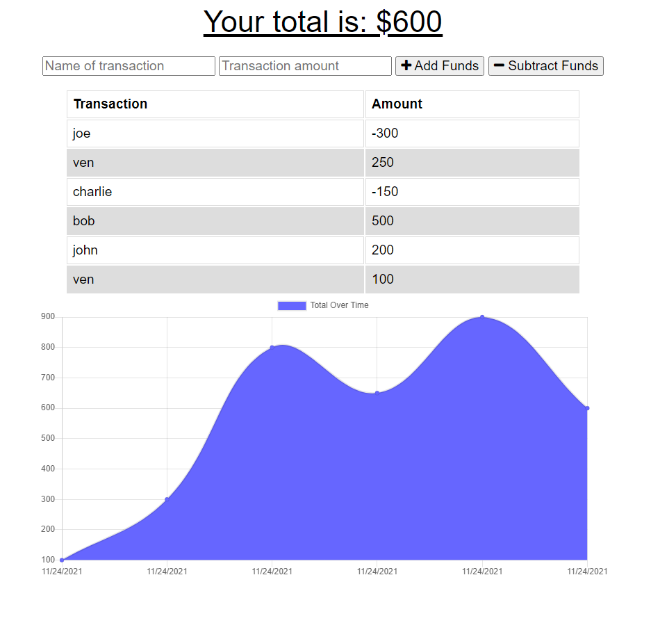

# Budget Tracker

## Description

This application was created so that users can be given a fast and easy way to track their money while allowing them access to that information at any time. For the ease of accessibility, the application also includes an offline functionality for users to use at any time and place.
 

## How to Use

When loading the application, users will be able to enter their name and their funds transaction to determime their spendings over a span of rate and time.

## Deployed Page

https://e-budget-tracker-pwa.herokuapp.com/

## Screenshot
 

 

## Contributions
Xander Rapstine
 
Ven Kim